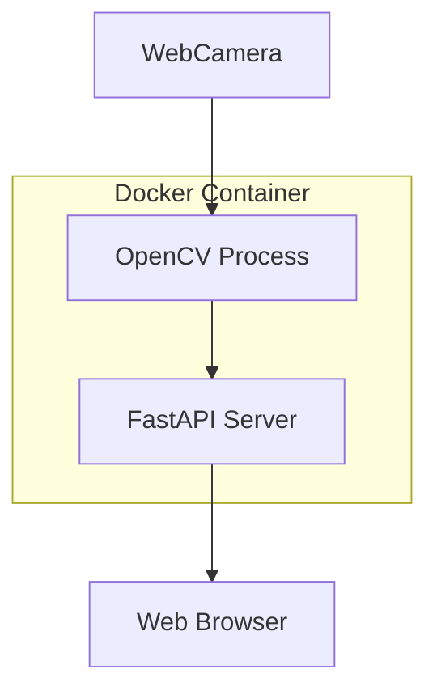
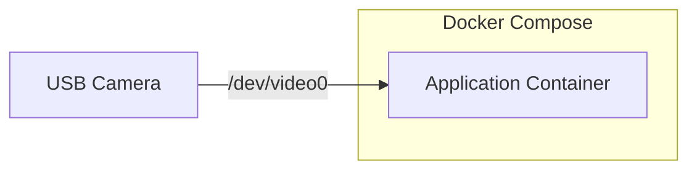

# OpenCVカメラアプリケーション 設計書

## 1. 概要

### 1.1 目的
- OpenCVを使用したカメラ映像表示アプリケーションの開発
- Linux環境での開発基盤の確立
- 将来的なWindows環境への移植性を考慮

### 1.2 システム構成図



## 2. 技術スタック

### 2.1 バックエンド
- Python 3.11
- OpenCV-Python
- FastAPI（Webサーバー）
- uvicorn（ASGIサーバー）

### 2.2 フロントエンド
- TypeScript
- Vite（ビルドツール）
- HTML5
- WebSocket for リアルタイム通信

### 2.3 開発環境
- Docker
- Docker Compose
- Visual Studio Code

## 3. 開発環境要件

### 3.1 必要なツール
- Docker Engine
- Docker Compose V2
- Git

### 3.2 推奨スペック
- CPU: 2コア以上
- メモリ: 4GB以上
- ストレージ: 10GB以上の空き容量
- USBポート: Webカメラ接続用

### 3.3 コンテナ構成


## 4. 実装手順

### 4.1 フェーズ1: 開発環境構築
- [ ] プロジェクトディレクトリ構造の作成
- [ ] Dockerfileの作成
- [ ] Docker Compose設定の作成
- [ ] .gitignoreの設定

### 4.2 フェーズ2: バックエンド実装
- [ ] OpenCVによるカメラ映像取得処理の実装
- [ ] FastAPIサーバーの実装
- [ ] WebSocket通信の実装

### 4.3 フェーズ3: フロントエンド実装
- [ ] 基本的なHTML/CSSの作成
- [ ] WebSocket通信のJavaScript実装
- [ ] 映像表示機能の実装

## 5. プロジェクトディレクトリ構造

```
anomaly-detection/
├── docker/
│   ├── Dockerfile
│   └── requirements.txt
├── src/
│   ├── backend/
│   │   ├── app.py
│   │   ├── camera.py
│   │   └── websocket.py
│   └── frontend/
│       ├── src/
│       │   ├── main.ts
│       │   ├── types/
│       │   │   └── index.d.ts
│       │   └── websocket.ts
│       ├── public/
│       │   └── index.html
│       ├── package.json
│       ├── tsconfig.json
│       ├── vite.config.ts
│       └── index.html
├── tests/
├── docker-compose.yml
└── README.md
```

## 6. 動作確認項目

### 6.1 環境構築確認
- [ ] Dockerコンテナが正常に起動すること
- [ ] コンテナ内でPythonが実行できること
- [ ] OpenCVがインストールされていること
- [ ] USBカメラがコンテナから認識されること

### 6.2 バックエンド動作確認
- [ ] カメラからの映像取得が可能なこと
- [ ] FastAPIサーバーが起動すること
- [ ] WebSocketコネクションが確立できること

### 6.3 フロントエンド動作確認
- [ ] ブラウザでページが表示されること
- [ ] WebSocketで映像データを受信できること
- [ ] カメラ映像がリアルタイムに表示されること

### 6.4 TypeScript関連の確認
- [ ] TypeScriptのコンパイルが正常に完了すること
- [ ] 型チェックにエラーがないこと
- [ ] Viteによるビルドが成功すること

### 6.5 パフォーマンス確認
- [ ] 映像のフレームレートが15fps以上であること
- [ ] CPU使用率が80%を超えないこと
- [ ] メモリリークがないこと

## 7. 制約事項・前提条件

### 7.1 実装範囲
- カメラ映像の表示のみを実装
- 画像処理や分析機能は含まない
- 設定変更UIは実装しない

### 7.2 動作保証環境
- Ubuntu 22.04 LTS
- Docker Engine 24.0以上
- Google Chrome 最新版

### 7.3 セキュリティ考慮事項
- ローカル環境での実行のみを想定
- 認証機能は実装しない
- SSL/TLSは実装しない